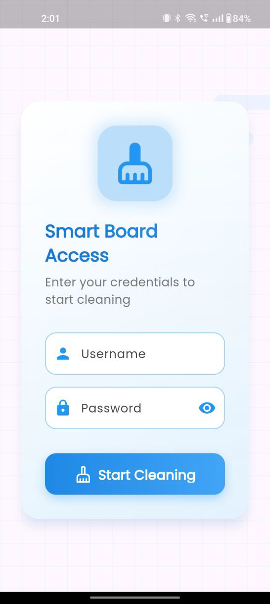
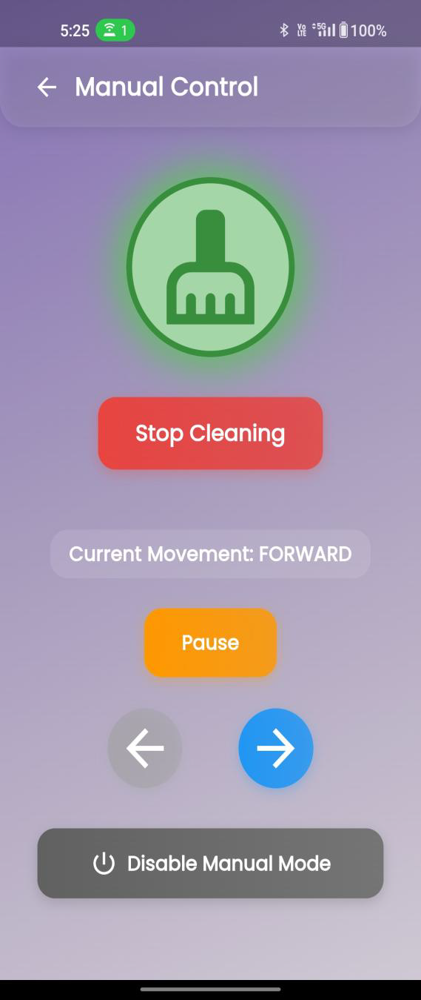
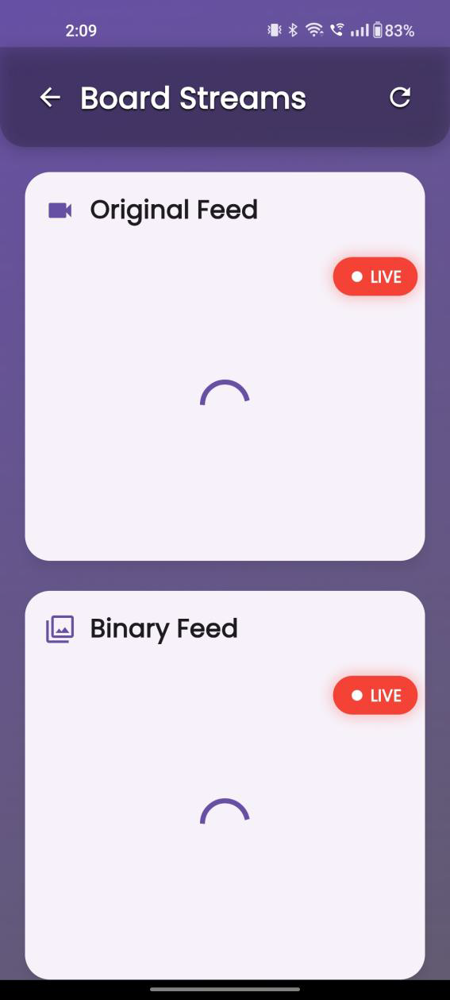
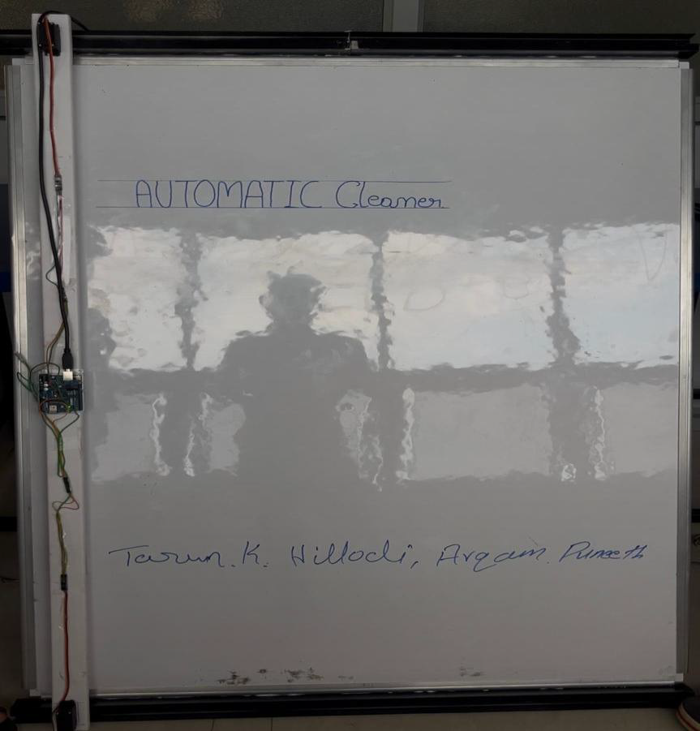
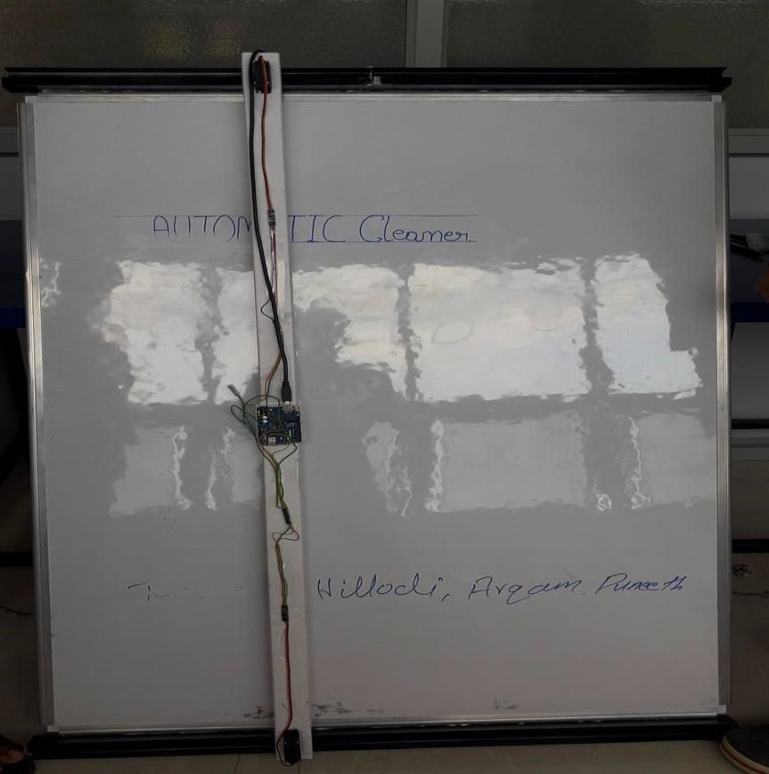

<h1 align="center">🤖 AI-Powered Automatic Board Cleaner</h1>

  

---

## 🚀 Overview

An **AI-powered automated whiteboard cleaning system** designed to provide efficient, consistent, and streak-free cleaning using intelligent path optimization.

This project integrates **Artificial Intelligence, IoT hardware, and a Flutter mobile application** to automate whiteboard cleaning in classrooms and offices.

---

## ✨ Features

- 🤖 AI-Based Automatic Cleaning  
- 📱 Flutter Mobile App Control  
- 🎙️ Voice Command Support  
- 📡 Live Video Streaming  
- ☁️ Firebase Real-time Synchronization  
- 🔄 Auto & Manual Modes  
- ⚡ Efficient Path Optimization  

---

## 🏗️ System Architecture

  

---

## ⚙️ Tech Stack

| Layer | Technology |
|------|-----------|
| Mobile App | Flutter |
| Backend | Firebase Firestore |
| AI/ML | Python (OpenCV) |
| Hardware | Arduino, Raspberry Pi |
| Streaming | Flask |

---

## 🔄 Working Flow

1. 📷 Webcam captures whiteboard image  
2. 🧠 AI analyzes board fill percentage  
3. ☁️ Data updated to Firebase  
4. ⚙️ Arduino activates motor  
5. 🧹 Cleaning process starts automatically  
6. 📱 User monitors through mobile app  

---

## 📱 App Screenshots

### 🚀 Splash Screen

  

---

### 🔐 Login Screen

  

---

### 🏠 Home Screen (Board Status)

  
  

---

### 🎛️ Manual Control

  
  

---

### 🎙️ Voice Assistant

  

---

### 📡 Live Streaming

  

---

## 🧪 Results (Before vs After Cleaning)

  
  

---

## 🧰 Hardware Used

- Arduino Uno  
- Raspberry Pi 4  
- Servo Motor (MG996R)  
- Webcam  
- Rack and Pinion Mechanism  

---

---

## 🎯 Results & Impact

- ⏱️ Reduced cleaning time significantly  
- 💪 Eliminated manual effort  
- 🎯 Achieved consistent cleaning quality  
- 📊 Real-time monitoring enabled  

---

## 🔮 Future Scope

- 🤖 Fully autonomous cleaning (no manual trigger)  
- 📡 Smart classroom integration  
- 🔋 Battery backup system  
- 🧠 Advanced AI for dirt detection  

---

